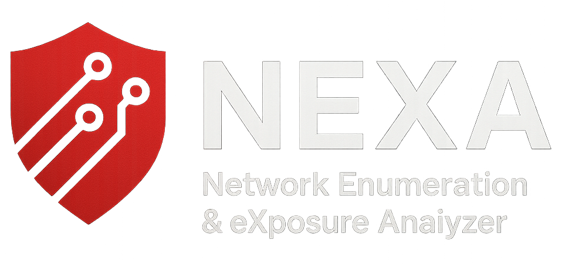

# NEXA - Network Enumeration & eXposure Analyzer

<p align="center">
  
</p>

A comprehensive automated enumeration script for Windows and Linux targets, designed for security professionals and penetration testers.

## Features

### 🌐 Target Support
- **IP Addresses**: Direct IP-based enumeration
- **Domain Names**: Domain-based enumeration with optional IP resolution
- **Flexible Input**: Automatically detects input type (IP vs Domain)
- **Windows Applications**: Windows service enumeration, web application scanning
- **Linux Applications**: Linux service enumeration, web application scanning
- **Active Directory**: SMB enumeration, LDAP enumeration, Kerberos enumeration
- **Comprehensive Mode**: Full enumeration for all target types

### 🔍 Enumeration Capabilities
- **Nmap Scans**: Basic, aggressive, and stealth scanning options
- **Web Application Enumeration**: Directory enumeration, vulnerability scanning, subdomains via Sublist3r + live probing via httpx
- **Active Directory Enumeration**: SMB, LDAP, Kerberos, and NetExec (nxc) checks
- **Service Enumeration**: Banner grabbing and service identification

### 🎨 User Interface
- Interactive menu-driven interface
- Color-coded output for better readability
- Progress indicators and status updates
- Organized output directory structure

## Prerequisites

### Required Tools
- **nmap**: Network discovery and security auditing
- **gobuster**: Directory/file enumeration
- **nuclei**: Modern vulnerability scanner with extensive template library
- **enum4linux-ng**: Modern Windows/SMB enumeration tool
- **ldapsearch**: LDAP query tool

### Installation Commands

#### Ubuntu/Debian
```bash
sudo apt update
sudo apt install nmap ldap-utils
```

#### macOS
```bash
brew sudo apt install nmap
```

#### Enum4linux-ng
```bash
# enum4linux-ng for Windows/SMB enumeration
sudo apt install enum4linux-ng
```

#### Go-based Tools
```bash
# GoBuster for directory enumeration
go install github.com/OJ/gobuster/v3/gobuster@latest

# Nuclei for vulnerability scanning
go install -v github.com/projectdiscovery/nuclei/v2/cmd/nuclei@latest
```

## Installation

1. Clone or download the script
2. Make it executable:
   ```bash
   chmod +x NEXA.sh
   ```

## Usage

### Basic Usage
```bash
./NEXA.sh
```

### Running with Root Privileges (Recommended)
```bash
sudo ./NEXA.sh
```

## Menu Structure

### Main Menu
1. **Windows Application Enumeration** - Specialized for Windows applications and services
2. **Linux Application Enumeration** - Optimized for Linux applications and services
3. **Active Directory Enumeration** - Specialized for Windows AD environments
4. **Comprehensive Enumeration** - Full assessment for all target types
5. **Exit** - Clean exit with results summary

### Windows Application Menu
1. **Basic Nmap Scan** - Standard port and service discovery
2. **Aggressive Nmap Scan** - Comprehensive scanning with vulnerability scripts
3. **Stealth Nmap Scan** - Low-profile scanning for sensitive environments
4. **Web Application Enumeration** - Web service discovery and testing
5. **Windows Service Enumeration** - Windows-specific service analysis
6. **Back to Main Menu**

### Linux Application Menu
1. **Basic Nmap Scan** - Standard port and service discovery
2. **Aggressive Nmap Scan** - Comprehensive scanning with vulnerability scripts
3. **Stealth Nmap Scan** - Low-profile scanning for sensitive environments
4. **Web Application Enumeration** - Web service discovery and testing
5. **Linux Service Enumeration** - Linux-specific service analysis
6. **Back to Main Menu**

### Active Directory Menu
1. **Basic Nmap Scan** - Standard port and service discovery
2. **SMB Enumeration** - Windows SMB service enumeration with enum4linux-ng
3. **LDAP Enumeration** - Active Directory LDAP service enumeration
4. **Kerberos Enumeration** - Windows authentication service enumeration
5. **NXC Enumeration** - NetExec-based AD service checks (smb/ldap/winrm)
6. **Full AD Enumeration** - Complete Active Directory assessment
7. **Back to Main Menu**

## Output Structure

The tool creates a timestamped output directory with the following structure:

```
enum_results_YYYYMMDD_HHMMSS/
├── nmap_basic_scan.txt
├── nmap_aggressive_scan.txt
├── nmap_stealth_scan.txt
├── web_enumeration/
│   ├── gobuster_dirs.txt
│   ├── nuclei_scan.txt
│   └── additional_enum.txt
├── ad_enumeration/
│   ├── enum4linux-ng_smb.txt
│   ├── ldap_enum.txt
│   ├── kerberos_enum.txt
│   └── ad_enumeration_summary.txt
├── windows_service_enum.txt
├── linux_service_enum.txt
└── enumeration_summary.txt
```

## Scan Types

### Nmap Scans
- **Basic**: `-sS -sV -O -p-` (SYN scan, version detection, OS detection, all ports)
- **Aggressive**: `-sS -sV -O -A -p- --script=vuln` (Includes vulnerability scripts)
- **Stealth**: `-sS -sV -O -p- --min-rate=100 --max-retries=2` (Lower detection risk)

### Web Enumeration
- Directory enumeration using Gobuster
- Vulnerability scanning with Nuclei (modern template-based scanner)
- Subdomain discovery via Sublist3r and live validation with httpx
- Port detection for web services (80, 443, 8080, 8443)

### Active Directory Enumeration
- SMB enumeration with enum4linux-ng (modern Python 3 tool)
- LDAP enumeration on ports 389, 636, 3268, 3269
- Kerberos enumeration on ports 88, 464
- NetExec (nxc) enumeration modules for SMB/LDAP/WinRM

## Docker

Build the image:

```bash
docker build -t nexa /path/to/NEXA
```

Run with host networking and bind mounts for outputs:

```bash
docker run --rm -it --net=host \
  -v /path/to/NEXA:/app \
  -v /path/to/outputs:/app/output \
  nexa
```

Inside the container, results are written under `/app/enum_results_...`. With the bind mounts above, you can access them on the host.

## Security Considerations

⚠️ **Important**: This tool is designed for authorized security testing only.

- **Legal Compliance**: Ensure you have proper authorization before scanning any target
- **Network Impact**: Some scans may generate significant network traffic
- **Detection Risk**: Aggressive scans may trigger security monitoring systems
- **Rate Limiting**: Use stealth options in production environments

## Troubleshooting

### Common Issues

1. **Permission Denied**: Run with `sudo` for certain operations
2. **Missing Dependencies**: Install required tools using the provided commands
3. **Scan Failures**: Check network connectivity and firewall settings
4. **Slow Performance**: Adjust scan rates or use stealth options

### Dependency Checks

The tool automatically checks for required dependencies and provides installation instructions for missing tools.

## Contributing

Feel free to submit issues, feature requests, or pull requests to improve the tool.

## License

This tool is provided for educational and authorized security testing purposes only.

## Disclaimer

The authors are not responsible for any misuse of this tool. Users must ensure they have proper authorization before conducting any security assessments.

---

**Happy Enumeration! 🚀**
